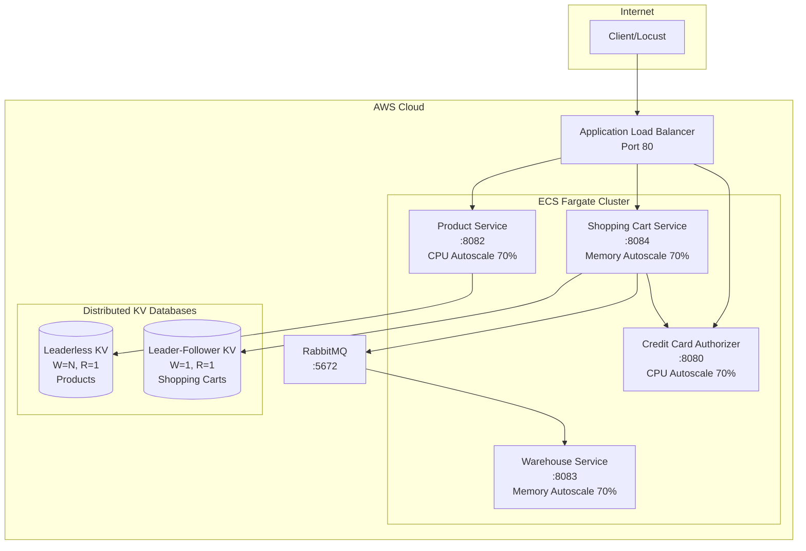
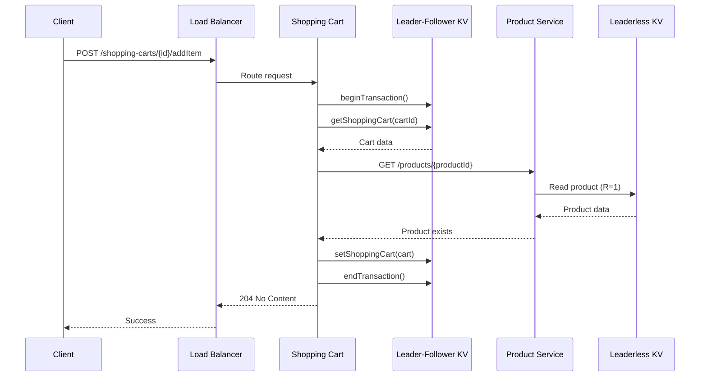
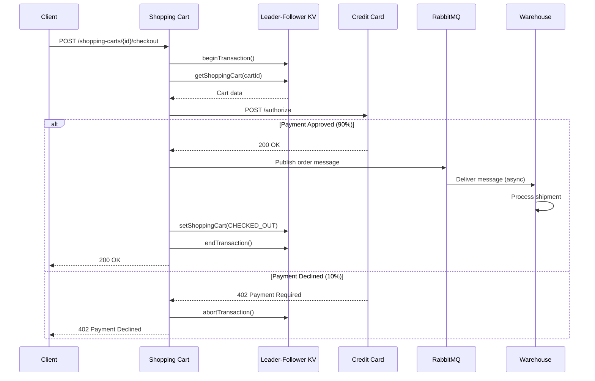
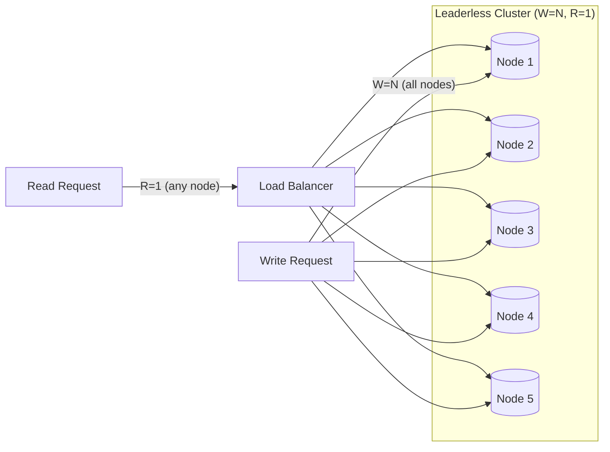
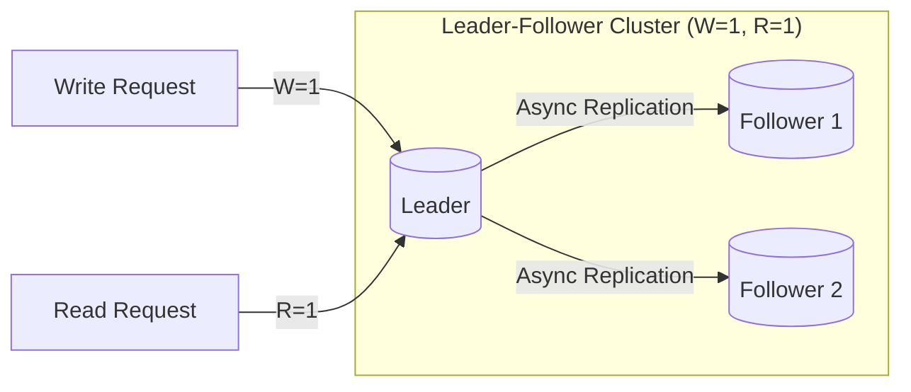
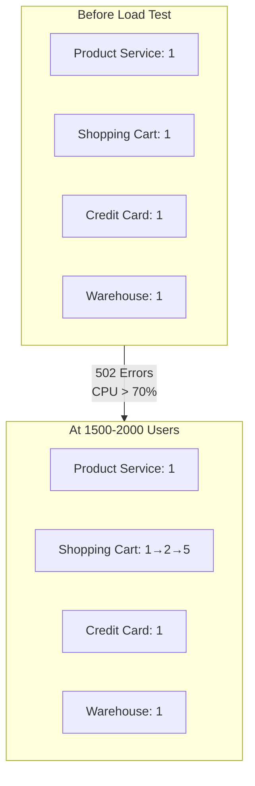

# CS6650 Assignment 5 - System Architecture

## High-Level Architecture

## Use Case 1: Add Item to Cart

## Use Case 2: Checkout Flow

## Database Replication Models

### Leaderless KV (Product Service)

### Leader-Follower KV (Shopping Cart Service)

## Autoscaling Behavior Under Load

## Key Design Decisions

| Component | Choice | Rationale |
|-----------|--------|-----------|
| Product DB | Leaderless (W=N, R=1) | Read-heavy, rare updates |
| Cart DB | Leader-Follower (W=1, R=1) | Write-heavy, fast responses |
| Warehouse | RabbitMQ (async) | Fire-and-forget shipping |
| CAP Trade-off | AP | Availability over consistency |
