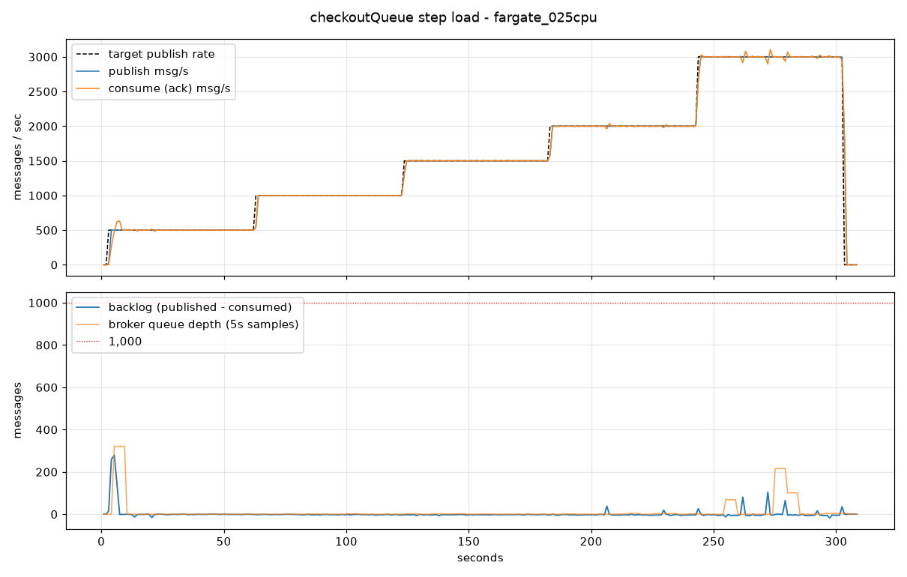
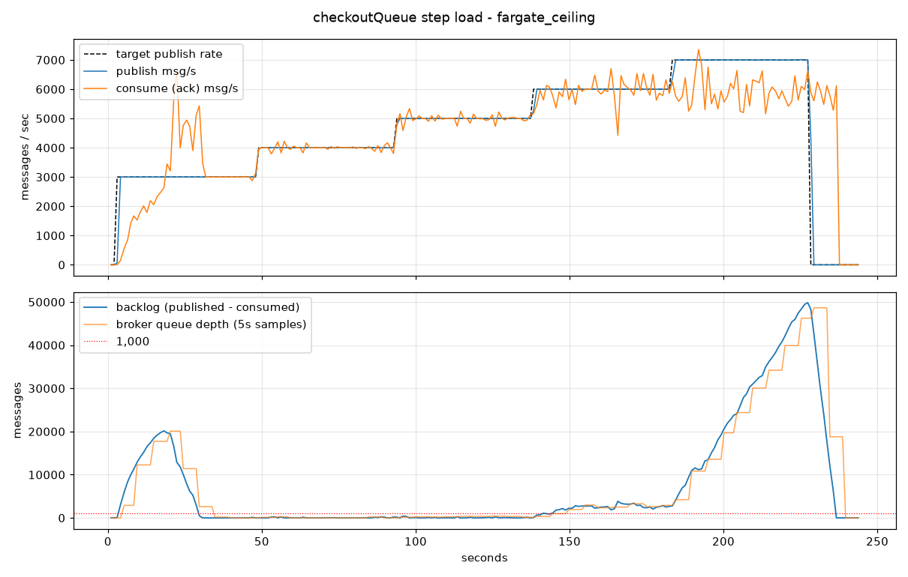

# RabbitMQ Warehouse Consumer Benchmark

A step-load benchmark of the Warehouse Service's RabbitMQ consumer (`checkoutQueue`).
It answers two questions: how many checkout messages per second one Warehouse task can
sustain, and how large the queue backlog gets while it does.

## Summary

With the same consumer settings as the ECS task definition (0.25 vCPU, 512 MB,
8–16 listener threads, prefetch 250, manual acks):

- **Sustained 3,000 msg/s with a steady-state backlog of at most 105 messages.**
- Up to 5,000 msg/s the backlog stayed at or below 408 messages.
- The consumer saturates at **~5,950 msg/s**. At that point the container is pinned
  at its 0.25 vCPU limit, and at 6,000 msg/s and above the backlog grows without bound.
- Every published message was consumed and acked (1,604,949 messages across both runs,
  0 lost).

## What is measured

| Component | Setup |
|-----------|-------|
| Consumer | `warehouse-service` jar in an `eclipse-temurin:17-jre` container, `--cpus=0.25 --memory=512m` (matches Fargate `cpu=256`, `memory=512`) |
| Listener | `SPRING_RABBITMQ_LISTENER_SIMPLE_CONCURRENCY=8`, `MAX_CONCURRENCY=16`, `PREFETCH=250`, manual ack (`WarehouseConsumer`) |
| Broker | `rabbitmq:3-management` (3.13) in Docker |
| Publisher | `bench.py`, one AMQP connection, persistent JSON messages in the same shape as `OrderMessage` (`order_id` plus 1–5 `{product_id, quantity}` items), sent to the default exchange with routing key `checkoutQueue` |

Once per second, the monitor thread records:

- **publish rate**: from the publisher's own counter.
- **consume rate**: from the change in `Total Orders` reported by `GET /warehouse/stats`. The
  counter is incremented just before `basicAck`, so it is an exact count of processed messages.
- **backlog**: published minus consumed. This includes messages that have been delivered
  and prefetched but not yet acked.
- **broker queue depth**: `messages` from the management API
  (`/api/queues/%2F/checkoutQueue`). Kept only as a cross-check, because the management
  plugin's `basic` rates mode refreshes it every 5 seconds.

## Results

### Run 1: steady state, 60 s per step (`results/fargate_025cpu.*`)

The JVM was warmed up by a short smoke test before this run.

| Target (msg/s) | Published (msg/s) | Consumed (msg/s) | Max backlog |
|---------------:|------------------:|-----------------:|------------:|
| 500   | 500   | 500   | 279 (first seconds after start) |
| 1,000 | 1,000 | 1,000 | 0   |
| 1,500 | 1,500 | 1,500 | 0   |
| 2,000 | 2,000 | 2,000 | 38  |
| 3,000 | 3,000 | 3,000 | 105 |

479,989 messages published, 479,989 consumed. The queue drained to 0 within seconds.



### Run 2: finding the ceiling, 45 s per step (`results/fargate_ceiling.*`)

This run started immediately after a container restart, with a cold JVM.

| Target (msg/s) | Published (msg/s) | Consumed (msg/s) | Max backlog |
|---------------:|------------------:|-----------------:|------------:|
| 3,000 | 3,000 | 3,017 | 20,150 (cold-start JIT warm-up, drained within seconds) |
| 4,000 | 4,000 | 3,995 | 235    |
| 5,000 | 5,000 | 5,003 | 408    |
| 6,000 | 6,000 | 5,948 | 3,855 and growing |
| 7,000 | 7,000 | 5,936 | 49,830 and growing |

1,124,960 messages published, 1,124,960 consumed after draining. In an earlier ceiling run
with the same container (steps of 4,000 / 5,000 / 6,000 / 8,000 msg/s), CPU usage of the
Warehouse container, sampled every 4 s with `docker stats`, stayed at about 25% (the full
0.25 vCPU) for the whole loaded period. At 8,000 msg/s that run also topped out at about
5,990 msg/s consumed.



## Caveats

- **This is a local, isolated consumer benchmark, not an end-to-end AWS test.** The broker
  and consumer ran on the same machine, so there was no cross-host network latency. A local
  CPU core is also not the same as a Fargate vCPU.
- **The full checkout path produces far fewer messages.** Each checkout goes through
  several injected 100–1000 ms delays (shopping cart controller and KV client), so the
  end-to-end load test publishes only a small fraction of these rates. These numbers
  describe the consumer's capacity, not the throughput the whole system reached.
- **Cold start matters.** Before the JVM warms up, a burst of 3,000 msg/s briefly built a
  backlog of about 20K messages. The backlog numbers above are steady-state values.
- `System.out.println` runs for every message in `WarehouseService.recordOrder`. It is
  part of the measured cost and likely one reason the 0.25 vCPU limit is reached near
  6K msg/s.

## Reproducing

Prerequisites: Docker, Java 17+, Maven, Python 3.

```bash
# From the repository root
mvn -q -f warehouse-service/pom.xml clean package -DskipTests

docker network create benchnet
docker run -d --name bench-rabbit --network benchnet \
  -p 5672:5672 -p 15672:15672 rabbitmq:3-management

# Wait until http://localhost:15672 responds (guest/guest), then:
docker run -d --name bench-warehouse --network benchnet \
  --cpus=0.25 --memory=512m -p 8083:8083 \
  -v "$PWD/warehouse-service/target/warehouse-service-1.0-SNAPSHOT.jar:/app/app.jar:ro" \
  -e SERVER_PORT=8083 -e SPRING_RABBITMQ_HOST=bench-rabbit \
  -e SPRING_RABBITMQ_LISTENER_SIMPLE_CONCURRENCY=8 \
  -e SPRING_RABBITMQ_LISTENER_SIMPLE_MAX_CONCURRENCY=16 \
  -e SPRING_RABBITMQ_LISTENER_SIMPLE_PREFETCH=250 \
  eclipse-temurin:17-jre sh -c "java -Xmx512m -Xms256m -jar /app/app.jar"

# Wait until http://localhost:8083/warehouse/stats responds, then:
cd benchmarks/rabbitmq-consumer
python3 -m venv .venv && .venv/bin/pip install -r requirements.txt
mkdir -p results && cd results

# bench.py <label> <comma-separated rates> <seconds per step> <max drain seconds>
../.venv/bin/python ../bench.py fargate_025cpu 500,1000,1500,2000,3000 60 300
../.venv/bin/python ../analyze.py fargate_025cpu   # prints the step table, writes <label>.png

# Clean up
docker rm -f bench-warehouse bench-rabbit && docker network rm benchnet
```

Run a short warm-up (for example `bench.py warmup 1000 10 30`) before a steady-state run,
or expect a cold-start spike at the first step. `bench.py` subtracts the consumer's
`Total Orders` at start, so the Warehouse container does not need a restart between runs.

## CSV columns

| Column | Meaning |
|--------|---------|
| `t` | Seconds since the monitor started |
| `target_rate` | Target publish rate of the current step (0 = idle or draining) |
| `client_published_total` | Messages published so far |
| `queue_depth`, `ready`, `unacked` | Broker-reported `messages`, `messages_ready`, `messages_unacknowledged` (5 s refresh) |
| `consumed_total` | Messages processed by the Warehouse since the run started |
| `publish_rate`, `consume_rate` | Per-second deltas of the two totals |
| `backlog_calc` | `client_published_total - consumed_total` |
| `consumers` | Consumers attached to `checkoutQueue` |
